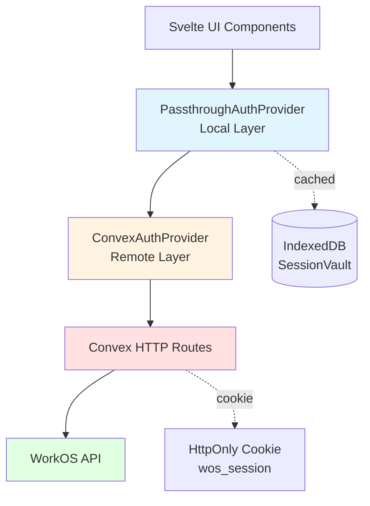
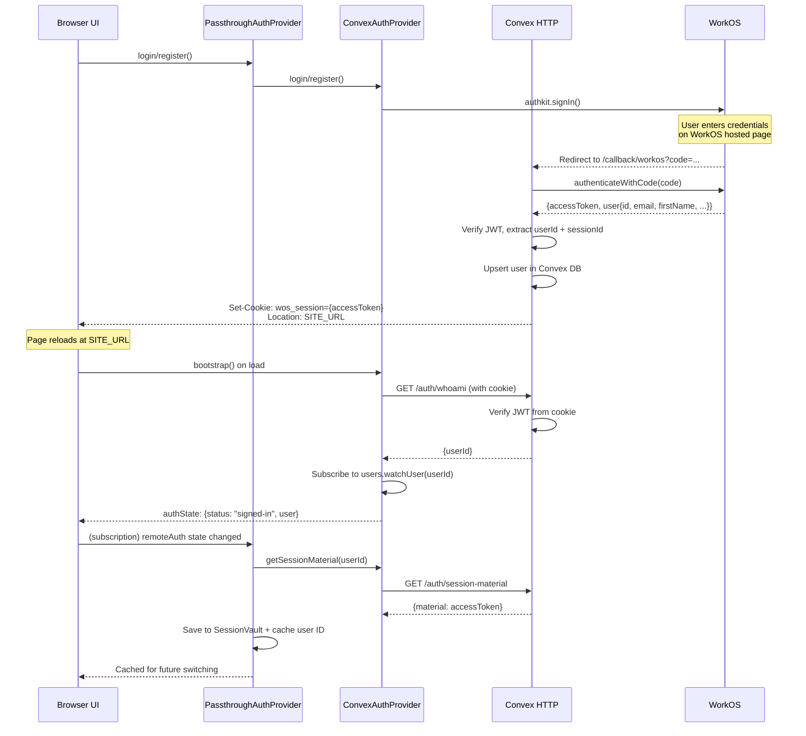
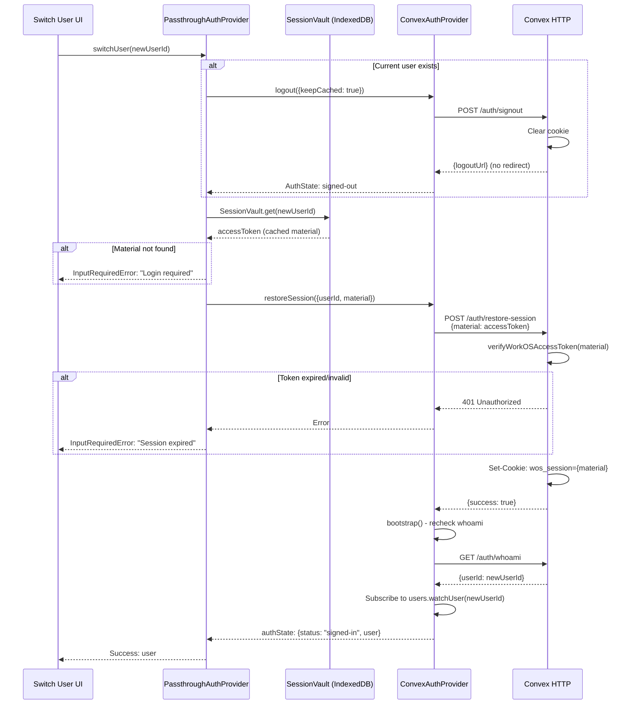

# Authentication System Architecture

**Last updated:** 2025-10-11

## Overview

Three-layer auth system: **PassthroughAuthProvider** (browser cache) → **ConvexAuthProvider** (Convex backend) → **WorkOS** (identity provider).

**Session material:** WorkOS JWT access token (stored in browser IndexedDB + HttpOnly cookie)

---

## Architecture Layers



### Layer 1: PassthroughAuthProvider (Client-side cache)
- **Purpose:** Multi-account switching without re-authentication
- **Storage:** IndexedDB (`SessionVault` for refresh tokens, `USER_TABLE_NAME` for user IDs)
- **Capabilities:**
  - Caches session material (access tokens) per user ID
  - Switches between cached users instantly
  - Delegates all auth operations to ConvexAuthProvider
  - Monitors remote auth state, auto-caches new sign-ins

### Layer 2: ConvexAuthProvider (Backend bridge)
- **Purpose:** Bridge between browser and WorkOS via Convex
- **Storage:** HttpOnly cookie (`wos_session`), Convex DB (`users` table)
- **Capabilities:**
  - Manages WorkOS OAuth flow
  - Verifies JWT tokens server-side
  - Upserts users in DB on first sign-in
  - Provides session restore/rotation for account switching

### Layer 3: WorkOS (Identity provider)
- **Purpose:** OAuth/SSO identity provider
- **Storage:** WorkOS sessions (server-side)
- **Provides:**
  - OAuth authorization code flow
  - JWT access tokens (signed, 10min expiry)
  - User profile data (email, name, avatar)
  - Session management (create/revoke)

---

## Data Flow: Login/Registration



### Key data exchanged:

1. **WorkOS → Convex:**
   - `accessToken` (JWT, 10min expiry)
   - `user` object: `{id, email, firstName, lastName, profilePictureUrl}`

2. **Convex → Browser:**
   - Cookie: `wos_session={accessToken}` (HttpOnly, Secure, SameSite=None)
   - User data via reactive query subscription

3. **Browser → IndexedDB:**
   - `SessionVault[userId]` = `accessToken` (for switching)
   - `USER_TABLE_NAME[userId]` = `{id: userId}` (list of cached accounts)

---

## Data Flow: Account Switching



### Session restoration steps:

1. **Logout current user** (keepCached=true)
   - Clears cookie
   - Does NOT revoke WorkOS session
   - Does NOT remove from SessionVault

2. **Retrieve cached material**
   - Read `accessToken` from SessionVault[newUserId]
   - If missing → prompt for login

3. **Restore session**
   - POST material to `/auth/restore-session`
   - Server verifies JWT still valid
   - Server sets new cookie with same token
   - Client re-bootstraps auth state

---

## Session Material Details

### What is "session material"?
The WorkOS JWT **access token** itself. It's opaque to the client but contains:
- `sub`: WorkOS user ID
- `sid`: WorkOS session ID
- `exp`: Expiration timestamp (10 minutes from issue)
- Signature (verified via WorkOS JWKS)

### Where is it stored?

| Location | Format | Purpose | Lifetime |
|----------|--------|---------|----------|
| **IndexedDB (SessionVault)** | Plain JWT string | Account switching | Until manually cleared |
| **HttpOnly Cookie** | Plain JWT string | Authenticating HTTP requests | Session-based (cleared on logout) |
| **WorkOS servers** | Session record | OAuth session state | Until revoked or expired |

### Token rotation?
Currently **NO rotation**. The same access token is reused from cache. WorkOS tokens are short-lived (10min), so switching to a cached user will fail if >10min since last use. Future: implement refresh token flow.

---

## Data Schemas

### SessionVault (IndexedDB)
```typescript
// Store: "session_vault"
// keyPath: "userId"
{
  userId: string,      // WorkOS user ID (e.g., "user_01HXYZ...")
  material: string     // JWT access token
}
```

### Users Cache (IndexedDB)
```typescript
// Store: USER_TABLE_NAME
// keyPath: "id"
{
  id: string  // Just a marker that this userId is cached
}
```

### Convex DB Schema
```typescript
// Table: "users"
{
  _id: Id<"users">,
  authId: string,           // WorkOS user ID
  displayName: string,
  avatarUrl?: string,
  status?: "active" | "deleted",
  features?: string[],
  settingOverrides?: any,
  _creationTime: number
}
```

### Cookie Format
```
wos_session={JWT_ACCESS_TOKEN}
Path=/
HttpOnly
Secure
SameSite=None
```

---

## HTTP Endpoints

### `GET /auth/whoami`
**Purpose:** Verify current session from cookie  
**Auth:** Cookie (`wos_session`)  
**Returns:** `{userId: string | null}`

### `GET /auth/session-material`
**Purpose:** Extract access token for caching  
**Auth:** Cookie (`wos_session`)  
**Returns:** `{material: string | null}`

### `POST /auth/restore-session`
**Purpose:** Restore cached session  
**Body:** `{material: string}`  
**Returns:** `{success: boolean}`  
**Side effect:** Sets `wos_session` cookie

### `POST /auth/signout`
**Purpose:** Clear session and get logout URL  
**Auth:** Cookie (`wos_session`)  
**Returns:** `{success: boolean, logoutUrl: string}`  
**Side effects:**
- Clears cookie
- Revokes WorkOS session
- Returns WorkOS logout URL (only used if `keepCached !== true`)

### `GET /callback/workos?code=...`
**Purpose:** Handle OAuth callback  
**Query:** `code` (WorkOS authorization code)  
**Returns:** 302 redirect to `SITE_URL`  
**Side effects:**
- Exchanges code for access token
- Upserts user in DB
- Sets `wos_session` cookie

---

## Current Issues & Debugging

### Common failure modes:

1. **Token expiry (10min lifetime)**
   - Symptom: Account switching fails with "Session expired"
   - Cause: Access tokens stored in SessionVault are only valid for 10 minutes
   - Fix: Implement refresh token flow (not yet done)

2. **Cookie not sent with requests**
   - Symptom: `/auth/whoami` returns `{userId: null}` even when logged in
   - Cause: CORS misconfiguration or missing `credentials: "include"`
   - Check: DevTools → Network → Request headers for `Cookie: wos_session=...`

3. **Race condition on initial load**
   - Symptom: UI shows "signed-out" briefly before "signed-in"
   - Cause: `bootstrap()` is async; authState starts as `{status: "loading"}`
   - Expected: UI should handle all three states (loading/signed-out/signed-in)

4. **User not cached after login**
   - Symptom: Can't switch to newly logged-in user
   - Debug: Check console logs for:
     - `[PassthroughAuthProvider] Cached new user session: {userId}`
     - `[TODO:debug EG] Cached users after adding new user: [...]`
   - Likely: Auth state subscription not firing or `getSessionMaterial` returning null

5. **Bootstrap called multiple times**
   - Symptom: Multiple "whoami" requests in Network tab
   - Cause: `visibilitychange` event listener re-runs bootstrap
   - Expected: Intentional behavior to detect cookie rotation

### Debug checklist:

- [ ] Verify cookie is set: DevTools → Application → Cookies → `wos_session`
- [ ] Verify JWT payload: Paste token into jwt.io, check `sub` and `exp`
- [ ] Check SessionVault: DevTools → Application → IndexedDB → `session_vault`
- [ ] Check user cache: IndexedDB → `USER_TABLE_NAME` (should list all cached user IDs)
- [ ] Check Convex DB: Convex Dashboard → Data → `users` table
- [ ] Check auth state: Add `$authState` to a Svelte component and display it

---

## Code Entry Points

### Client-side:
- `/src/lib/API/Auth/index.ts` - Exports `authAPI`, `authState`, `cachedUsers`
- `/src/lib/API/Auth/PassthroughAuthProvider.ts` - Local caching layer
- `/src/lib/API/Auth/ConvexAuthProvider.ts` - Remote backend bridge
- `/src/lib/API/Auth/SessionVault.ts` - IndexedDB session storage
- `/src/lib/API/Auth/seam-interfaces.ts` - TypeScript interfaces

### Server-side (Convex):
- `/src/convex/http.ts` - HTTP route handlers
- `/src/convex/node/workos.ts` - WorkOS SDK integration (OAuth callback, session revoke)
- `/src/convex/lib/workosSession.ts` - JWT verification, cookie parsing
- `/src/convex/users.ts` - User CRUD mutations/queries
- `/src/convex/schema.ts` - Database schema

### UI:
- `/src/routes/(login-register)/login/+page.svelte` - Login form
- `/src/routes/(login-register)/register/+page.svelte` - Registration form
- `/src/routes/(login-register)/switch-user/+page.svelte` - Account switcher
- `/src/routes/+layout.svelte` - Root layout (bootstraps auth)

---

## Ownership

**Owner:** Ethan Gunter  
**System boundaries:**
- **In:** OAuth login/logout, account switching, session persistence
- **Out:** Password reset (handled by WorkOS), MFA (WorkOS), device management

**Related systems:**
- Task sync (depends on `authState` for current user)
- User settings (scoped to current user from `authState`)


