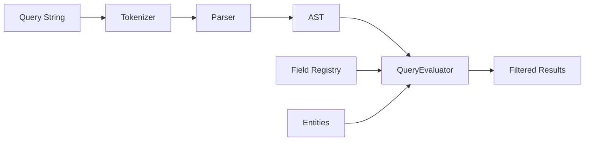

# Query System

A flexible query parser and evaluator for filtering entities using a custom query language.

## Quick Example

    priority>=3 AND status==[open,in-progress] OR due<=2025-01-01

## How It Works

## Query Syntax

**Basic Format:** `field operator value`

**Operators:**
- `==` equals/contains
- `!=` not equals
- `>=` `<=` `>` `<` comparison
- `~=` fuzzy match

**Logical Operators:**
- `AND` / `&&` / `&` (implicit between terms)
- `OR` / `||` / `|`
- `()` grouping

**Value Types:**
- **Single:** `status==open`
- **Collection:** `status==[open,closed]` (OR logic)
- **Range:** `priority==1..5`
- **Tolerance:** `value==100±5` or `value==100+/-5`

**Examples:**

    name==john                          # contains "john"
    priority>=3                         # greater than or equal
    status==[open,in-progress]          # any of these
    priority==2..4                      # range 2 to 4
    value==100±5                        # 95 to 105
    priority>3 status==open             # implicit AND
    priority>3 OR status==closed        # explicit OR

## Setup

Register fields with handlers that define:
- Which operators are supported
- How to transform string values
- How to match against entities

    const registry: FieldRegistry<Task> = {
      priority: fieldHandler({
        operators: compareOps('==', '!=', '>=', '<=', '>', '<'),
        valueOps: valueOps('..', '+', '-'),
        transformValue: (v) => parseInt(v),
        matches: (task, op, value) => compareNumeric(task.priority, op, value),
        arith: { add: (a, b) => a + b, sub: (a, b) => a - b }
      })
    };

## Usage

    const evaluator = new QueryEvaluator(registry);
    const ast = parseQuery("priority>=3 status==open");
    const results = evaluator.evaluate(entities, ast);